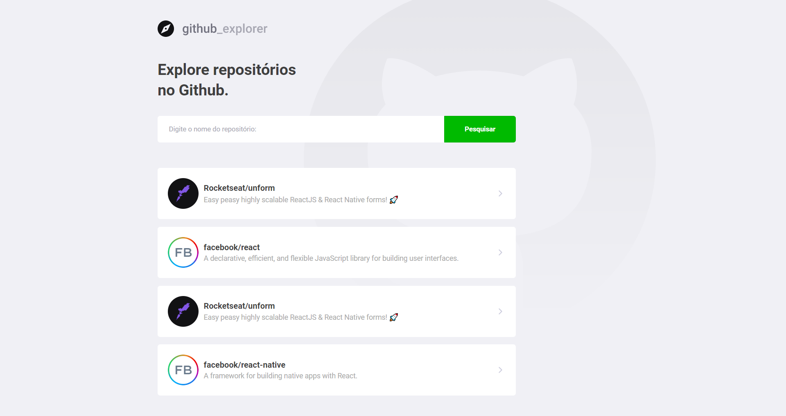
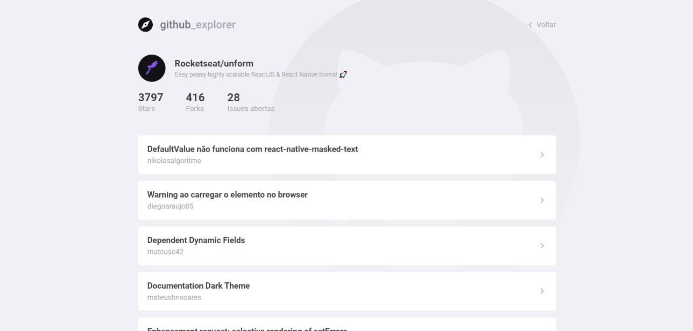

# GitHub Explorer

This app allows you to track and explore your favorite GitHub repositories. Made with React, HTML, CSS and JavaScript.

## Visuals
### Dashboard

### Repository Details

## Contributing
Pull requests are welcome. For major changes, please open an issue first to discuss what you would like to change.

## License
[MIT](https://choosealicense.com/licenses/mit/)
